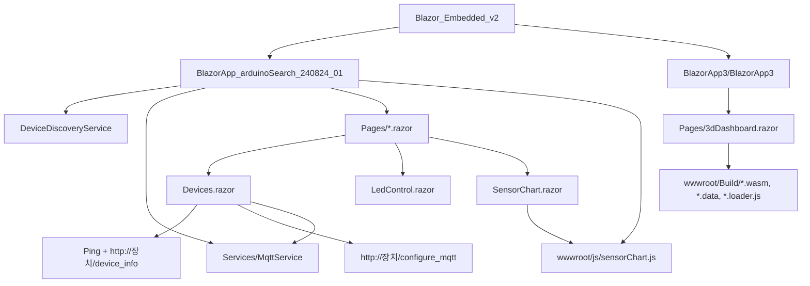

# 프로젝트 분석

## 1. 프로젝트 개요

이 저장소는 Blazor 기반 임베디드/IoT 연동 실험 프로젝트로 보인다. 루트에는 두 개의 Blazor 프로젝트가 있으며, 역할은 다음처럼 구분된다.

| 구분 | 경로 | 유형 | 주요 목적 |
| --- | --- | --- | --- |
| Arduino 장치 검색/제어 앱 | `BlazorApp_arduinoSearch_240824_01` | Blazor Server, .NET 6 | 로컬 네트워크 장치 검색, MQTT 연결, LED 제어, 센서 차트 표시 |
| 3D 대시보드 앱 | `BlazorApp3/BlazorApp3` | Blazor WebAssembly/PWA, .NET 6 | 샘플 Blazor WASM 화면과 Unity WebGL 기반 3D 대시보드 로딩 |

루트 `README.md`는 제목만 있고 프로젝트 목적, 실행 방법, 장치 연동 조건은 아직 정리되어 있지 않다.

## 2. 전체 구조

## 3. Arduino 장치 검색/제어 앱 분석

### 3.1 실행 진입점

`BlazorApp_arduinoSearch_240824_01/Program.cs`

- Razor Pages와 Server Side Blazor를 등록한다.
- `WeatherForecastService`, `DeviceDiscoveryService`, `MqttService`를 DI에 등록한다.
- 앱을 `http://0.0.0.0:5000`에 바인딩한다.
- `appsettings.json`에도 Kestrel HTTP 5000 설정이 있다.

현재 `MqttService`는 싱글톤으로 등록되어 있어 사용자별/화면별 MQTT 연결 상태가 하나의 인스턴스에 공유된다. 단일 장치 실험에는 단순하지만, 여러 브라우저 탭이나 여러 장치를 동시에 다루는 구조에는 위험하다.

### 3.2 장치 검색 흐름

`BlazorApp_arduinoSearch_240824_01/DeviceDiscoveryService.cs`

1. 서버의 IPv4 주소를 조회한다.
2. `172.30.1.1`부터 `172.30.1.253`까지 순회한다.
3. 서버 IP와 `172.30.1.254`는 제외한다.
4. 각 IP에 대해 Ping을 수행한다.
5. 응답이 있으면 `http://{ip}/device_info`를 호출해 장치 정보를 읽는다.
6. 성공하면 `Device` 목록에 추가하고, 실패하면 오류 설명을 가진 `Device`를 추가한다.

주요 특징:

- 네트워크 대역이 코드에 고정되어 있다.
- Ping timeout 주석은 3초라고 되어 있으나 실제 값은 1000ms다.
- 최대 253개의 작업을 한 번에 생성하므로 네트워크/CPU 상황에 따라 부하가 커질 수 있다.
- `Device` 모델이 같은 파일 하단에 있으며 속성은 모두 nullable이 아닌 `string`이지만 기본값이 없다.

### 3.3 MQTT 흐름

`BlazorApp_arduinoSearch_240824_01/Services/MqttService.cs`

- `MQTTnet` 기반 클라이언트를 생성한다.
- `ConnectAsync(server, port, topic)` 호출 시 TCP MQTT 브로커에 연결한다.
- 연결 이벤트에서 현재 `topic`을 구독한다.
- 수신 메시지는 `OnMessageReceived` 이벤트로 Razor 컴포넌트에 전달한다.
- `PublishMessageAsync(topic, message)`는 QoS ExactlyOnce로 메시지를 발행한다.

주의할 점:

- 재연결, 연결 실패, 구독 실패, 발행 실패에 대한 사용자 피드백이 부족하다.
- `topic` 필드가 연결 이벤트에서 사용되므로 연결 시점과 이벤트 시점의 상태 관리가 중요하다.
- 싱글톤 서비스이므로 이벤트 구독 해제를 정확히 하지 않으면 이전 화면의 핸들러가 남을 수 있다.
- `Dispose`는 있으나 DI 등록상 앱 수명과 맞춰 관리되는 구조가 명확하지 않다.

### 3.4 주요 화면

`Pages/Devices.razor`

- 장치 검색 결과를 테이블로 보여준다.
- 장치별 MQTT 서버/포트/토픽을 입력받는다.
- 연결 후 장치에 `/configure_mqtt` POST 요청을 보낸다.
- 장치 이름에 따라 새 탭으로 제어/차트 화면을 연다.

현재 라우팅 확인 결과:

- `Arduino LED Controller` -> `/ledControl` 존재
- `Soil Moisture Sensor` -> `/soilMoistureChart` 존재
- `DHZ Sensor` -> `/DHZChart` 이동을 시도하지만 해당 `@page`는 현재 프로젝트에 없다.

`Pages/LedControl.razor`

- 쿼리스트링에서 MQTT 주소, 포트, 토픽을 읽는다.
- MQTT 연결 후 `home/led` 토픽으로 `ON`, `OFF`를 발행한다.
- 입력받은 `mqttTopic`이 아닌 고정 토픽을 사용한다.
- 이벤트 해제 코드가 등록한 람다와 다른 람다를 사용하므로 실제 해제가 되지 않는다.

`Pages/SensorChart.razor`

- `@page "/soilMoistureChart"`로 등록되어 있다.
- MQTT 메시지를 JSON으로 파싱해 온도, 습도, 토양 수분 데이터를 Chart.js 차트로 전달한다.
- `async void HandleMqttMessage`는 예외 전파와 테스트가 어렵다.
- 메시지 파싱 실패, 잘못된 토픽, 잘못된 포맷에 대한 방어가 필요하다.

### 3.5 JavaScript 연동

`Pages/_Layout.cshtml`

- `openInNewTab(url)`을 전역 함수로 제공한다.
- `_framework/blazor.server.js`를 로드한다.

`Pages/_Host.cshtml`

- Chart.js CDN과 `js/sensorChart.js`를 로드한다.
- `_Host.cshtml`에도 HTML 전체 구조가 들어 있고 `_Layout.cshtml`도 HTML 전체 구조를 갖고 있어 구조를 정리할 필요가 있다.

`wwwroot/js/sensorChart.js`

- 전역 `window.temperatureChart`, `window.humidityChart`, `window.soilMoistureChart`를 사용한다.
- 단일 화면에서는 동작하기 쉽지만, 여러 차트 화면이 동시에 열리면 전역 상태 충돌 가능성이 있다.

## 4. Blazor WebAssembly/3D 대시보드 앱 분석

`BlazorApp3/BlazorApp3`

- .NET 6 Blazor WebAssembly 프로젝트다.
- PWA 서비스워커와 manifest가 포함되어 있다.
- 기본 Counter/FetchData 샘플 화면이 남아 있다.
- `Pages/3dDashboard.razor`에서 JS `eval`로 Unity WebGL 로더를 구성한다.
- Unity 빌드 산출물은 `wwwroot/Build` 아래에 있다.

주의할 점:

- `eval` 사용은 보안, 디버깅, 유지보수 측면에서 분리된 JS 파일로 옮기는 것이 좋다.
- `wwwroot/index.html`의 dismiss 텍스트가 깨져 보인다.
- Unity build 파일명이 `wwwroot.*` 형태라 의미가 약하고, 빌드 산출물 관리 기준이 필요하다.

## 5. 빌드/검증 상태

현재 `dotnet build --no-restore`를 두 솔루션에 실행했으며 다음 상태를 확인했다.

| 대상 | 결과 | 내용 |
| --- | --- | --- |
| `BlazorApp_arduinoSearch_240824_01.sln` | 실패 | `obj/project.assets.json` 없음. NuGet restore 필요 |
| `BlazorApp3.sln` | 실패 | `obj/project.assets.json` 없음. NuGet restore 필요 |

공통 경고:

- 대상 프레임워크 `net6.0`은 지원 종료 상태로 표시된다.

따라서 정확한 컴파일 오류 여부는 `dotnet restore` 이후 다시 확인해야 한다.

## 6. 주요 개선 방향

1. 실행/빌드 기준 정리
   - `dotnet restore`, `dotnet build`, 실행 명령을 README에 명확히 작성한다.
   - 두 프로젝트를 계속 분리할지, 하나의 솔루션으로 통합할지 결정한다.

2. .NET 버전 업그레이드
   - `net6.0` 지원 종료 경고를 해소한다.
   - 조직/장비 배포 기준에 맞춰 최신 LTS 기반으로 업그레이드한다.

3. 장치 검색 설정화
   - IP 대역, 제외 IP, Ping timeout, 동시성 제한을 `appsettings.json`으로 옮긴다.
   - 장치 검색 진행률과 실패 원인을 UI에 보여준다.

4. MQTT 연결 모델 개선
   - 사용자/장치별 연결 상태가 분리되도록 서비스 수명을 재검토한다.
   - 연결 실패, 재연결, 구독 실패, 발행 실패 처리를 추가한다.
   - 토픽을 하드코딩하지 않고 장치 설정과 화면 상태에서 일관되게 사용한다.

5. 화면 라우팅 정리
   - 존재하지 않는 `/DHZChart` 라우팅을 구현하거나 제거한다.
   - 장치 이름 문자열 비교 대신 장치 유형 enum 또는 capability 기반 분기로 바꾼다.

6. JS interop 정리
   - Chart.js와 Unity 로딩 코드를 모듈화한다.
   - 전역 window 상태를 줄이고 컴포넌트별 정리 로직을 강화한다.

7. 테스트와 품질 기준 추가
   - 서비스 단위 테스트를 추가한다.
   - 장치 검색/MQTT 메시지 파싱은 인터페이스로 분리해 모킹 가능하게 만든다.
   - CI에서 restore/build/test를 확인하도록 구성한다.

## 7. 문서 관리 기준

- 설계 변경이나 구조 분석은 `설계/` 폴더에 기록한다.
- 앞으로 개발하거나 개선할 작업 목록은 `개발/` 폴더에 기록한다.
- 실제 진행한 작업, 변경 파일, 검증 결과, 남은 이슈는 `작업진행현황/` 폴더에 날짜별로 기록한다.
